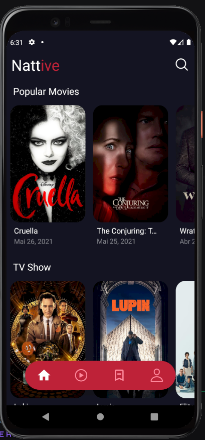
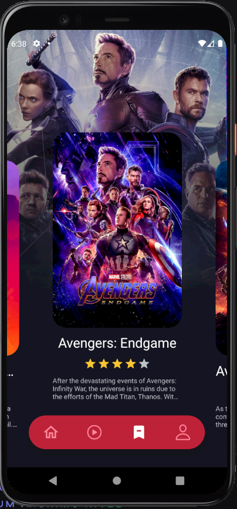

 <h1>Nattive Movies 🎞 </h1>

  

## 🚀 Tecnologias

Esse projeto foi desenvolvido com as seguintes tecnologias:

- [React](https://reactjs.org)
- [TypeScript](https://www.typescriptlang.org/)
- [Expo](https://docs.expo.io/)
- [TMDB api](https://developers.themoviedb.org/3)

## 💻 Projeto

Nattive Movies é um projeto feito inspirado em serviços de streaming. Nele é possível
ver filmes e séries do momento, em um layout simples mas muito agradável.

## 🔖 Layout

Este layout foi inspirado em um projeto do dribble.

- [Layout](https://dribbble.com/shots/14791304-Movies-app-design/attachments/6497678?mode=media)

## 📁 Scripts

Para instalar as dependências utilize:

- yarn

Para rodar a aplicação utilize:

- yarn start ou expo start
